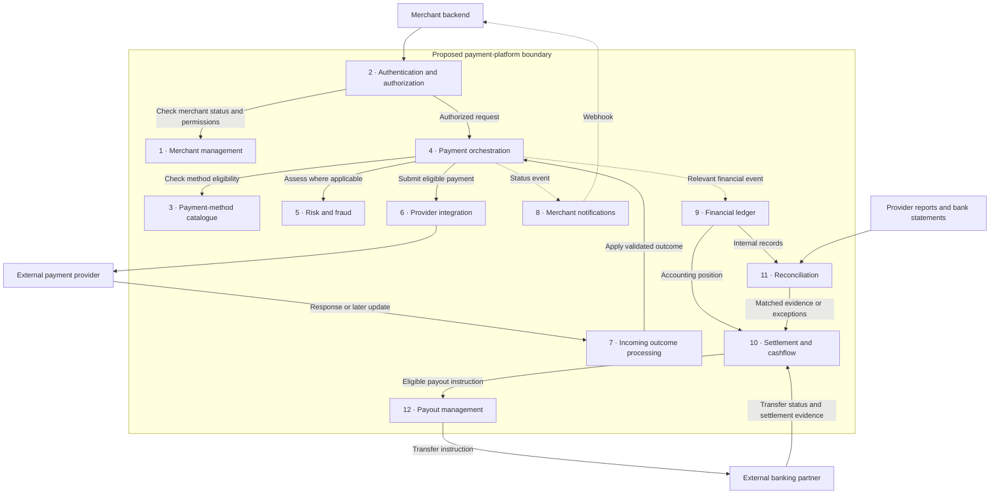

```mermaid
flowchart TB
    merchant["Merchant backend"] --> access["2 · Authentication and authorization"]

    subgraph platform["Proposed payment-platform boundary"]
        access -->|"Check merchant status and permissions"| merchants["1 · Merchant management"]
        access -->|"Authorized request"| payment["4 · Payment orchestration"]

        payment -->|"Check method eligibility"| catalogue["3 · Payment-method catalogue"]
        payment -->|"Assess where applicable"| risk["5 · Risk and fraud"]
        payment -->|"Submit eligible payment"| connector["6 · Provider integration"]

        incoming["7 · Incoming outcome processing"] -->|"Apply validated outcome"| payment
        payment -.->|"Status event"| notifications["8 · Merchant notifications"]
        payment -.->|"Relevant financial event"| ledger["9 · Financial ledger"]

        ledger -->|"Accounting position"| cashflow["10 · Settlement and cashflow"]
        ledger -->|"Internal records"| reconciliation["11 · Reconciliation"]
        reconciliation -->|"Matched evidence or exceptions"| cashflow
        cashflow -->|"Eligible payout instruction"| payouts["12 · Payout management"]
    end

    connector --> provider["External payment provider"]
    provider -->|"Response or later update"| incoming
    notifications -.->|"Webhook"| merchant

    external["Provider reports and bank statements"] --> reconciliation
    payouts -->|"Transfer instruction"| bank["External banking partner"]
    bank -->|"Transfer status and settlement evidence"| cashflow
```
