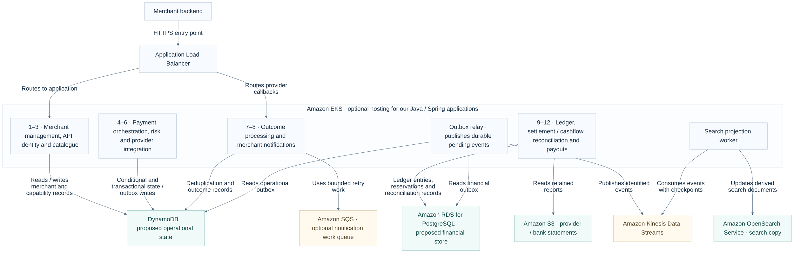

```mermaid
%%{init: {"theme":"base","themeVariables":{"fontFamily":"Arial, sans-serif","fontSize":"20px","primaryTextColor":"#20354a","secondaryTextColor":"#20354a","tertiaryTextColor":"#20354a","lineColor":"#526b82","edgeLabelBackground":"#ffffff","clusterBkg":"#fcfdff","clusterBorder":"#dce5ee"},"flowchart":{"htmlLabels":false,"nodeSpacing":35,"rankSpacing":60,"useMaxWidth":false}}}%%
flowchart TB
    merchant["Merchant backend"] -->|"HTTPS entry point"| ingress["Application Load Balancer"]
    ingress -->|"Routes to application"| identity
    ingress -->|"Routes provider callbacks"| outcomes

    subgraph compute["Amazon EKS · optional hosting for our Java / Spring applications"]
        identity["1–3 · Merchant management, API identity and catalogue"]
        payments["4–6 · Payment orchestration, risk and provider integration"]
        outcomes["7–8 · Outcome processing and merchant notifications"]
        finance["9–12 · Ledger, settlement / cashflow, reconciliation and payouts"]
        relay["Outbox relay · publishes durable pending events"]
        projection["Search projection worker"]
    end

    identity -->|"Reads / writes merchant and capability records"| state["DynamoDB · proposed operational state"]
    payments -->|"Conditional and transactional state / outbox writes"| state
    outcomes -->|"Deduplication and outcome records"| state
    finance -->|"Ledger entries, reservations and reconciliation records"| sql["Amazon RDS for PostgreSQL · proposed financial store"]
    finance -->|"Reads retained reports"| objects["Amazon S3 · provider / bank statements"]
    outcomes -->|"Uses bounded retry work"| queue["Amazon SQS · optional notification work queue"]
    relay -->|"Reads operational outbox"| state
    relay -->|"Reads financial outbox"| sql
    relay -->|"Publishes identified events"| stream["Amazon Kinesis Data Streams"]
    projection -->|"Consumes events with checkpoints"| stream
    projection -->|"Updates derived search documents"| search["Amazon OpenSearch Service · search copy"]

    classDef default fill:#f7faff,stroke:#bac9d8,color:#20354a
    classDef storage fill:#f0faf8,stroke:#9bc9c3,color:#164b49
    classDef messaging fill:#fff9ee,stroke:#d8c9ab,color:#5e4b2d
    class state,sql,objects,search storage
    class stream,queue messaging
    style compute fill:#fcfdff,stroke:#dce5ee
```
