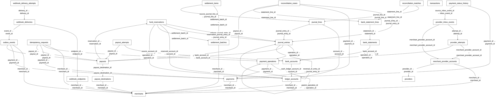

```mermaid
%%{init: {"theme":"base","themeVariables":{"primaryColor":"#ffffff","primaryTextColor":"#000000","primaryBorderColor":"#000000","lineColor":"#000000","fontSize":"22px"},"flowchart":{"useMaxWidth":false}}}%%
flowchart TB
  bank_accounts["bank_accounts"]
  bank_statement_lines["bank_statement_lines"]
  bank_statements["bank_statements"]
  fund_reservations["fund_reservations"]
  idempotency_requests["idempotency_requests"]
  journal_entries["journal_entries"]
  journal_lines["journal_lines"]
  ledger_accounts["ledger_accounts"]
  merchant_provider_accounts["merchant_provider_accounts"]
  merchants["merchants"]
  outbox_events["outbox_events"]
  payment_operations["payment_operations"]
  payment_status_history["payment_status_history"]
  payments["payments"]
  payout_attempts["payout_attempts"]
  payout_destinations["payout_destinations"]
  payouts["payouts"]
  provider_attempts["provider_attempts"]
  provider_inbox_events["provider_inbox_events"]
  providers["providers"]
  reconciliation_cases["reconciliation_cases"]
  reconciliation_matches["reconciliation_matches"]
  settlement_batches["settlement_batches"]
  settlement_items["settlement_items"]
  transactions["transactions"]
  webhook_deliveries["webhook_deliveries"]
  webhook_delivery_attempts["webhook_delivery_attempts"]
  webhook_endpoints["webhook_endpoints"]
  bank_accounts -->|"cash_ledger_account_id → account_id"| ledger_accounts
  bank_statement_lines -->|"statement_id → statement_id"| bank_statements
  bank_statements -->|"bank_account_id → bank_account_id"| bank_accounts
  fund_reservations -->|"release_journal_entry_id → journal_entry_id"| journal_entries
  fund_reservations -->|"reservation_journal_entry_id → journal_entry_id"| journal_entries
  fund_reservations -->|"reserved_account_id → account_id"| ledger_accounts
  fund_reservations -->|"settlement_batch_id → settlement_batch_id"| settlement_batches
  fund_reservations -->|"source_account_id → account_id"| ledger_accounts
  idempotency_requests -->|"merchant_id → merchant_id"| merchants
  idempotency_requests -->|"operation_id → operation_id"| payment_operations
  idempotency_requests -->|"payment_id → payment_id"| payments
  idempotency_requests -->|"payout_id → payout_id"| payouts
  journal_entries -->|"operation_id → operation_id"| payment_operations
  journal_entries -->|"payout_id → payout_id"| payouts
  journal_entries -->|"reversal_of_entry_id → journal_entry_id"| journal_entries
  journal_lines -->|"account_id → account_id"| ledger_accounts
  journal_lines -->|"journal_entry_id → journal_entry_id"| journal_entries
  ledger_accounts -->|"merchant_id → merchant_id"| merchants
  merchant_provider_accounts -->|"merchant_id → merchant_id"| merchants
  merchant_provider_accounts -->|"provider_id → provider_id"| providers
  outbox_events -->|"merchant_id → merchant_id"| merchants
  outbox_events -->|"payment_id → payment_id"| payments
  outbox_events -->|"payout_id → payout_id"| payouts
  payment_operations -->|"parent_operation_id → operation_id"| payment_operations
  payment_operations -->|"payment_id → payment_id"| payments
  payment_status_history -->|"payment_id → payment_id"| payments
  payment_status_history -->|"source_inbox_event_id → inbox_event_id"| provider_inbox_events
  payments -->|"merchant_id → merchant_id"| merchants
  payout_attempts -->|"bank_account_id → bank_account_id"| bank_accounts
  payout_attempts -->|"payout_id → payout_id"| payouts
  payout_destinations -->|"merchant_id → merchant_id"| merchants
  payouts -->|"payout_destination_id → payout_destination_id"| payout_destinations
  payouts -->|"reservation_id → reservation_id"| fund_reservations
  provider_attempts -->|"merchant_provider_account_id → merchant_provider_account_id"| merchant_provider_accounts
  provider_attempts -->|"operation_id → operation_id"| payment_operations
  provider_inbox_events -->|"attempt_id → attempt_id"| provider_attempts
  provider_inbox_events -->|"merchant_provider_account_id → merchant_provider_account_id"| merchant_provider_accounts
  reconciliation_cases -->|"journal_entry_id → journal_entry_id"| journal_entries
  reconciliation_cases -->|"payment_id → payment_id"| payments
  reconciliation_cases -->|"payout_id → payout_id"| payouts
  reconciliation_cases -->|"statement_line_id → statement_line_id"| bank_statement_lines
  reconciliation_matches -->|"journal_line_id → journal_line_id"| journal_lines
  reconciliation_matches -->|"statement_line_id → statement_line_id"| bank_statement_lines
  settlement_batches -->|"merchant_id → merchant_id"| merchants
  settlement_items -->|"settlement_batch_id → settlement_batch_id"| settlement_batches
  settlement_items -->|"source_journal_line_id → journal_line_id"| journal_lines
  webhook_deliveries -->|"endpoint_id → endpoint_id"| webhook_endpoints
  webhook_deliveries -->|"event_id → event_id"| outbox_events
  webhook_delivery_attempts -->|"delivery_id → delivery_id"| webhook_deliveries
  webhook_endpoints -->|"merchant_id → merchant_id"| merchants
```
